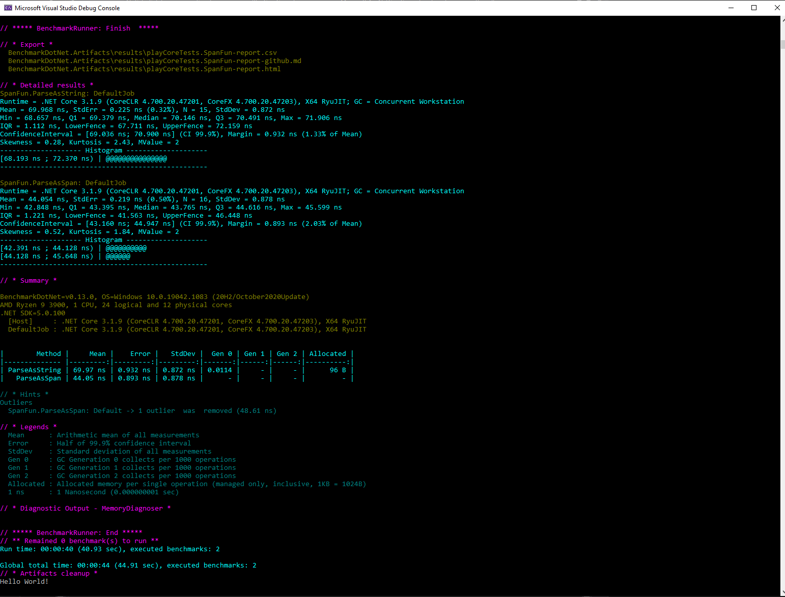

# C# abuse
Abusing C# language, checking various language specific behaviors.

# Sockets

There are two sets of projects (client + server) that you can play with. They all live in this same [solution](https://github.com/sagasu/Playground/blob/master/Core/playCore/playCore.sln) file. You can run a pair at this same time by specifying Solution -> Properties -> Startup Project -> Multiple Startup Project. And choose client/server pair or more then that.

* [Core Web Socket Client Using Default MS lib](https://github.com/sagasu/Playground/tree/master/Core/playCore/WebSocketClient)
* [Core Web Socket Server Using Default MS lib](https://github.com/sagasu/Playground/tree/master/Core/playCore/WebSocketServer)

The websocket sharp pair is using [websocket sharp library](https://github.com/sta/websocket-sharp) to be more precise it is using it's .net core clone - because the original library only works on .NET Framework. 